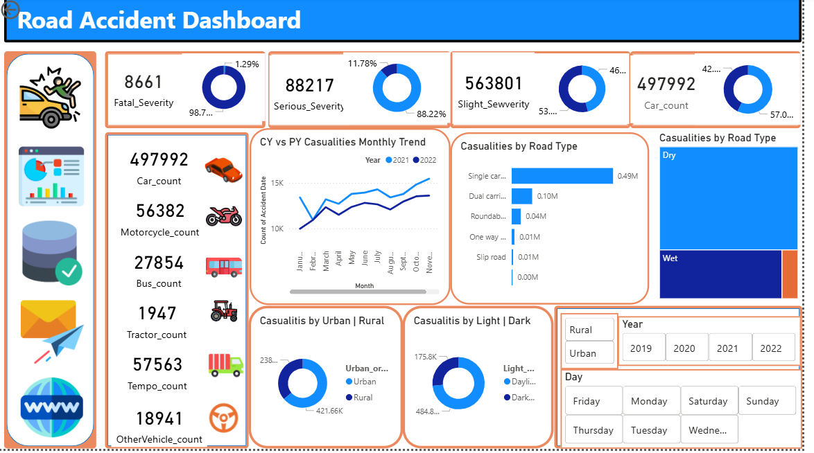

# 🚦 Road Accident Analysis Dashboard (Power BI)

An interactive **Power BI dashboard** designed to analyze and visualize road accident data.  
This project provides clear insights into accident severity, vehicle involvement, road conditions, and time-based trends to support data-driven decision making.

---

## 📌 Project Overview

The **Road Accident Dashboard** helps stakeholders:

- Understand accident severity distribution
- Analyze monthly casualty trends (Current Year vs Previous Year)
- Identify high-risk road types and conditions
- Compare urban vs rural accident distribution
- Evaluate impact of light and weather conditions
- Filter data dynamically by Year and Day

This dashboard transforms raw accident data into meaningful, visual insights.

---

## 🖼️ Dashboard Preview

---

## 📊 Key Insights & Features

### 1️⃣ Severity Breakdown
- Fatal Severity  
- Serious Severity  
- Slight Severity  
Displayed using donut charts for quick comparison.

---

### 2️⃣ Vehicle Involvement
- 🚗 Cars
- 🏍 Motorcycles
- 🚌 Buses
- 🚜 Tractors
- 🚚 Tempo
- 🚙 Other Vehicles  

Helps identify which vehicle types are most frequently involved in accidents.

---

### 3️⃣ Monthly Casualty Trend (CY vs PY)
- Comparison between **Current Year (2022)** and **Previous Year (2021)**
- Detects growth or decline in accident cases
- Useful for trend analysis and forecasting

---

### 4️⃣ Casualties by Road Type
- Single Carriageway
- Dual Carriageway
- Roundabout
- One Way
- Slip Road

Identifies which road infrastructure contributes most to accidents.

---

### 5️⃣ Urban vs Rural Analysis
Clear distribution of accident occurrences across:
- Urban Areas
- Rural Areas

---

### 6️⃣ Light Condition Analysis
- Daylight
- Dark

Evaluates accident occurrence based on visibility conditions.

---

### 7️⃣ Weather Condition Impact
- Dry
- Wet
- Other Conditions

Helps understand environmental risk factors.

---

### 8️⃣ Interactive Filters
- 📅 Year Selector (2019–2022)
- 📆 Day Selector (Monday–Sunday)
- 🏙 Urban / Rural Toggle

Users can dynamically explore the data.

---

## 🛠 Tools & Technologies Used

- **Power BI Desktop**
- DAX (Data Analysis Expressions)
- Data Modeling
- Data Cleaning & Transformation
- Interactive Visual Design

---

## 📈 Business Use Cases

This dashboard can be used by:

- Government transport departments
- Traffic safety authorities
- Insurance companies
- Urban planning teams
- Road safety analysts

---

## 🌟 Advanced Key Outcomes & Insights

This dashboard is not just a visualization tool — it uncovers behavioral, environmental, and infrastructure-driven accident patterns.

### 🔎 1️⃣ Severity Reality Check
- Majority of accidents fall under **Slight Severity**, but the volume is extremely high.
- Fatal cases are lower in count, yet represent critical impact on public safety.
- Even small percentage fatality rates translate into large human cost at scale.

💡 Insight: Prevention strategies should not only focus on fatal accidents but also reduce high-frequency slight incidents that can escalate over time.

---

### 📈 2️⃣ Rising Monthly Trend Pattern
- Clear upward pattern observed in mid-to-late months.
- 2022 shows noticeable growth compared to 2021 in several months.
- Certain seasonal clusters indicate possible environmental or traffic-density triggers.

💡 Insight: Traffic volume and seasonal factors likely influence accident peaks.

---

### 🚗 3️⃣ Vehicle Dominance Pattern
- Cars account for the highest accident involvement.
- Motorcycles show significant representation relative to volume.
- Heavy vehicles (bus, tractor, tempo) contribute smaller but high-impact cases.

💡 Insight: Two-wheelers and private cars should be primary focus of safety campaigns.

---

### 🛣 4️⃣ Infrastructure Risk Identification
- **Single Carriageways** dominate accident share.
- Roundabouts and slip roads show comparatively lower involvement.
- Road design significantly impacts casualty distribution.

💡 Insight: Narrow roads, limited lane separation, and overtaking behavior may increase risk.

---

### 🌆 5️⃣ Urban vs Rural Contrast
- Urban areas show higher accident frequency.
- Rural accidents, though fewer, may involve higher severity due to speed factors.

💡 Insight: Urban = volume risk. Rural = severity risk.

---

### 🌤 6️⃣ Light Condition Impact
- Daylight accidents are significantly higher than dark conditions.
- Indicates traffic density influences accidents more than visibility alone.

💡 Insight: Human behavior & congestion matter more than lighting alone.

---

### 🌧 7️⃣ Weather Condition Impact
- Dry conditions dominate accident share.
- Wet conditions contribute notable percentage but not majority.

💡 Insight: Driver behavior in normal conditions may be more careless due to overconfidence.

---

### 🧠 8️⃣ Behavioral Risk Hypothesis
- High accident numbers during normal driving conditions (dry + daylight).
- Suggests behavioral negligence, speed, distraction, or congestion as key factors.

---

## 🚀 Business Recommendations

Based on data-driven insights, the following strategic actions are recommended:

---

### 🎯 1️⃣ Targeted Road Infrastructure Improvement
- Upgrade high-risk Single Carriageways.
- Add lane dividers, reflective markers, and smart signage.
- Introduce speed-calming measures in high-density urban zones.

---

### 📢 2️⃣ Behavioral Awareness Campaigns
- Focus campaigns on:
  - Urban car drivers
  - Motorcycle riders
  - Peak traffic hours
- Promote defensive driving techniques.
- Encourage helmet & seatbelt compliance enforcement.

---

### 📊 3️⃣ Predictive Risk Monitoring
- Use historical data to build predictive accident-risk models.
- Deploy AI-based alert systems for:
  - Seasonal risk alerts
  - High-density zones
  - Weather-triggered warnings

---

### 🛡 4️⃣ Smart Enforcement Strategy
- Increase traffic surveillance in:
  - Urban congestion hotspots
  - High-volume single carriageways
- Install AI-enabled speed cameras.
- Deploy dynamic penalty mechanisms.

---

### 🌍 5️⃣ Urban Planning Strategy
- Encourage better public transport adoption to reduce private car density.
- Redesign traffic flow in major urban clusters.
- Implement intelligent traffic management systems.

---

### 📉 6️⃣ Insurance & Risk Pricing Model
- Insurance providers can:
  - Adjust premiums based on road-type exposure
  - Offer incentives for safe-driving score systems
  - Integrate telematics-based driver scoring

---

### 📌 7️⃣ Long-Term Policy Direction
- Data suggests behavior-driven accidents dominate.
- Shift policy focus from infrastructure-only to:
  - Driver psychology
  - AI monitoring
  - Real-time traffic analytics

---

## 💡 Final Takeaway

Accidents are not random events —  
they are predictable patterns shaped by infrastructure, environment, and human behavior.

This dashboard transforms raw accident data into:
- Actionable safety insights
- Strategic planning inputs
- Preventive intelligence framework

The goal is not just analysis —  
The goal is safer roads, smarter cities, and data-driven governance.
